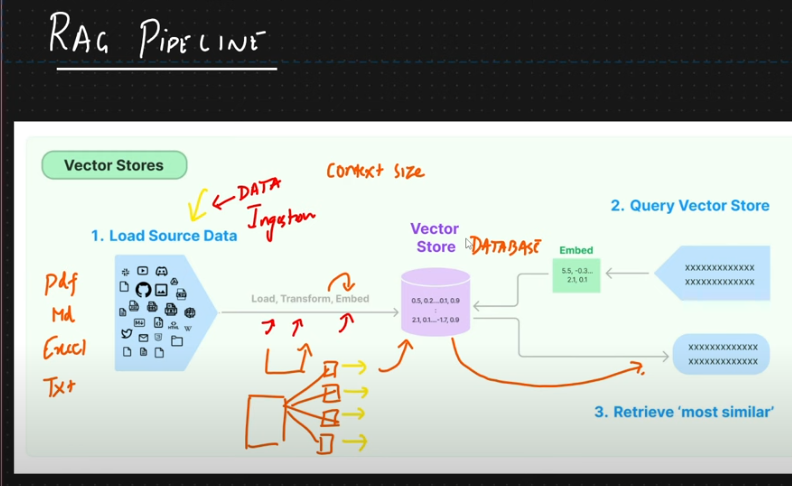
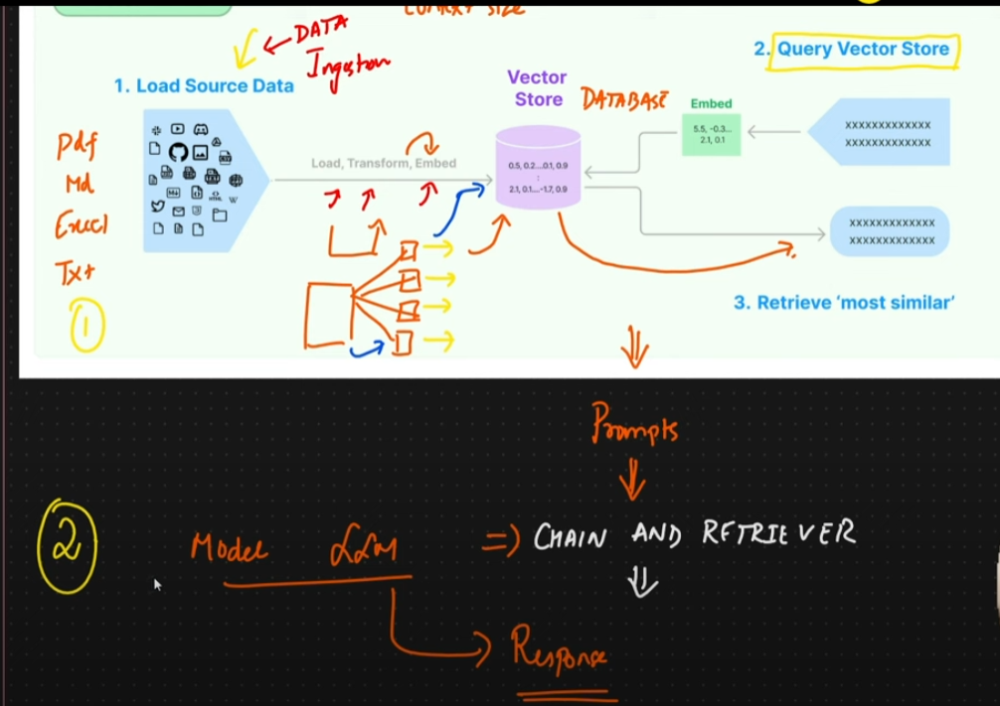
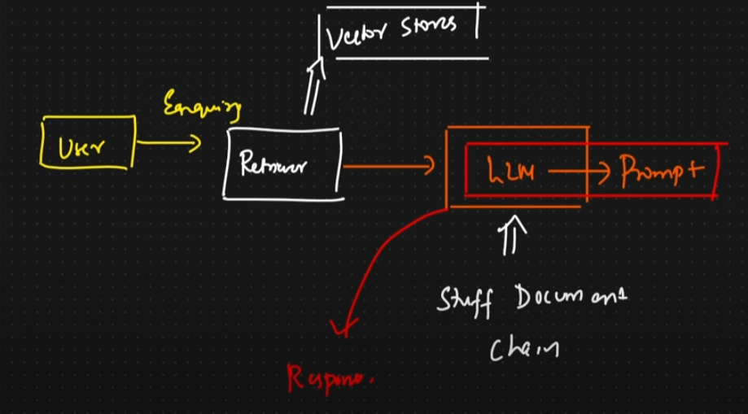
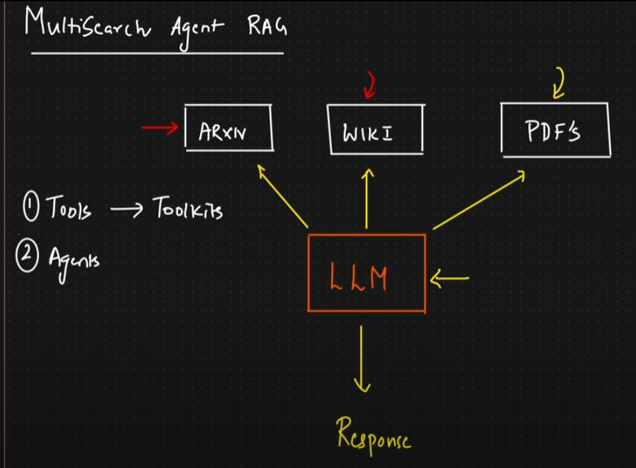

conda create -p venv python=3.10

conda activate venv

pip install -r requirements.txt

ollama list

streamlit run <filename>

3.App

4.Advanced RAG Q & A Chatbot with Chain and Retrievers

5.Multisearch Agent RAG

